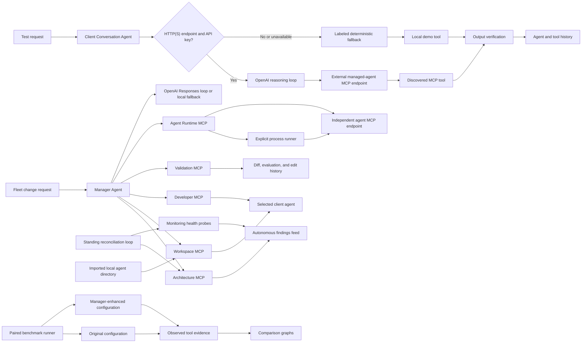

# Agentic AI Manager

Agentic AI Manager is a working control-plane MVP for a fleet of independent
agents. It discovers what the fleet can already do, prevents duplicate or
conflicting capability work, attaches reusable or newly built tools to the
right agents, watches for drift, and keeps the decisions and evidence visible.
A Manager workspace can stage or apply agent-instruction changes, while a
separate Test mode talks directly to the selected client agent and verifies its
real output.

The project is designed to make the complete loop visible in one demo: fleet
reasoning, context gathering, real tool attachment and execution, ongoing
reconciliation, and measured before/after evidence.

## What works

- Live architecture index seeded with agents, tools, endpoints, and data sources
- Relevance-ranked discovery of reusable system components
- Optional OpenAI Responses API routing with a deterministic no-key fallback
- Safe, inspectable Python tool generation for supported architecture-dependent workflows
- Static AST policy, dependency, JSON-schema, runtime, and output-contract validation
- Registration into a persistent JSON metadata store
- Continuous representative-input health probes
- Standing zero-token fleet reconciliation for capability drift, independent duplicates, contract conflicts, and endpoint failures
- Edge-triggered ArchitectureAgent review and a separate autonomous-finding feed
- Paired, persisted benchmarks comparing original and Manager-enhanced agent
  configurations with the same executable tool probes
- Side-by-side score, coverage, grounding, verification, latency, and
  per-scenario evidence graphs in React
- Persistent, agent-scoped conversation history
- Conversational client-agent editing through the Manager Agent
- OpenAI Responses API tool-calling loop when `OPENAI_API_KEY` is configured
- Per-agent OpenAI Sol, Terra, or Luna model selection and compatible
  reasoning-effort overrides, with application-default inheritance
- Deterministic offline orchestration through the same specialist-tool sequence
- Per-client local workspace sectors with `agent.json`, `instructions.md`, and `tools.json`
- Managed-agent directory import with project metadata, instruction, language,
  entrypoint, and MCP endpoint detection
- Scoped source indexing for imported projects, with relevant real files passed
  into Manager workspace inspection
- Explicit start, stop, status, and captured-log controls for an imported
  agent's configured local run command
- Manager-driven runtime operation through a real internal MCP handshake:
  scoped status, saved-command launch, endpoint readiness, capability
  discovery, live tool calls, provenance capture, and process shutdown
- Expandable execution receipts containing workspace scope, process PID and
  command, discovered server/tools, remote endpoint, tool arguments/output,
  and live source/proof fields
- User-selectable Review and Auto write modes
- Focused or full agent-context import for each request
- Per-message tool traces and acceptance-criteria-based output verification
- Minimal MCP Streamable HTTP-style JSON-RPC gateways for the specialist services
- Manager specialist coordination through real internal MCP
  `initialize → tools/list → tools/call` handshakes for Architecture, Workspace,
  Developer, Validation, and Runtime operations, with gateway receipts retained
  on every action
- MCP capability discovery for every managed agent through `initialize`, `tools/list`, `prompts/list`, and `resources/list`
- Editable per-agent MCP endpoints with connection testing and discovered-tool inspection
- Live client-agent conversations that let OpenAI reason over discovered HTTP(S) MCP tools and execute them remotely
- Explicit `Live MCP`, `Fallback demo`, and `Local demo` receipts on every client-agent response
- An independent support-agent server under `external_agent/` for realistic cross-process MCP testing
- Workspace-scoped file discovery plus explicit Auto-only source writes and
  Python verification, with traversal, symlink, size, and secret-file
  protections
- Standalone multi-page React/Vite control plane with dedicated Dashboard, Workspace, Managed agents, Activity, and System health routes
- Mock enterprise commerce endpoints so the demo runs completely locally

## Architecture



The React frontend and FastAPI backend are independent applications. Vite owns the UI development and production build; Uvicorn runs only the REST and MCP APIs. Every backend agent has its own module under `backend/app/agents`. REST and MCP transports are separate from the agents, so each agent can later move into an independent service without changing its domain logic.

## Quick start

```bash
python3 -m venv .venv
source .venv/bin/activate
pip install -e '.[dev]'
cd frontend && npm install
```

Start the complete application from one terminal:

```bash
make dev
```

This starts both services, prefixes their combined logs, and stops both with one Ctrl+C. It normally uses ports 5173 and 8000; if either is already occupied, the launcher automatically selects the next open port and prints the exact URLs. The dashboard is preloaded with the primary demo prompt and no API key is required.

The UI is divided into focused routes:

| Route | Purpose |
|---|---|
| `/` | See active work, agent status, attention items, and recent activity |
| `/workspace` | Edit an agent's configuration or switch to Test mode to query and verify it |
| `/agents` | Browse agents or add a local agent directory to the managed fleet |
| `/agents/:agentId` | Review one agent's conversations, capabilities, source connection, runtime, and nested tool workspaces |
| `/benchmarks` | Run and inspect paired before/after capability benchmarks |
| `/history` | Return to agent conversations and capability runs |
| `/health` | Review continuous probes |

Each data-heavy route follows the same progressive-disclosure model: search
first, filter by the relevant dimensions, and open deeper evidence only when
needed. Raw workspace files are not a main product surface; they are used only
as scoped context evidence during Manager orchestration.

Workspace fills the complete browser viewport. The global sidebar retracts into
one floating menu control and opens as a translucent overlay, so it never takes
width away from the workspace. Agents are selected from one compact list rather
than a permanent row. Manager mode is dominated by conversation, with history
and client files on the left and live tool routing, changes, and validation on
the right. Test mode remains a separate direct conversation with the client
agent.

Navigation, filters, disclosures, cards, feedback, and routed workspaces use a
shared motion system with reduced-motion accessibility support. Typography uses
a softer rounded system stack, while monospaced type is reserved for tool names
and technical contracts.

`make dev` works from both the project root and the `frontend/` directory.

You can also invoke the launcher directly:

```bash
.venv/bin/python scripts/dev.py
```

The individual `make dev-backend` and `make dev-frontend` commands remain available when separate terminals are useful.

To enable model-backed routing, copy `.env.example` to `.env` and replace
`your_api_key_here`. The backend loads the project-root `.env` automatically;
values already exported in the shell take precedence. Never put the key in the
React frontend.

```bash
cp .env.example .env
# Edit OPENAI_API_KEY in .env, then:
make dev
```

The application-wide default model is `gpt-5.6-terra`, the balanced current
GPT-5.6 tier for this interactive tool-using workload.
`OPENAI_REASONING_EFFORT=low` keeps ordinary loops responsive. Optional
`OPENAI_PROJECT_ID` and `OPENAI_ORGANIZATION_ID` values add the corresponding
request headers when a key needs explicit billing attribution. All OpenAI
requests remain server-side, use the Responses API, default to `store=false`,
apply bounded output tokens and retries, and preserve visible local fallback
behavior.

Each managed agent can inherit those defaults or choose its own GPT-5.6 Sol,
Terra, or Luna model and reasoning effort directly from the model control in
the **Workspace** header or from **Managed agents → agent → Overview → OpenAI
model**. Both controls persist through the same agent-update API. These
settings control the Manager's OpenAI orchestration for that agent and the
Manager-hosted live Responses API loop in **Workspace → Test client**; they do
not silently reconfigure the internal model of a separately hosted agent.
Every successful live Test response includes its effective model and reasoning
effort in the verification evidence. Local and fallback demo conversations do
not call OpenAI.

After startup, open **System health → OpenAI Responses API → Test connection**.
This explicit button sends one small readiness request and reports the actual
response model and request ID. Background health and fleet reconciliation do
not spend OpenAI tokens.

For client-agent Test mode, an HTTP(S) `mcp_endpoint` plus
`OPENAI_API_KEY` activates the live reasoning path. The model sees the tools
advertised by that endpoint, chooses tool calls, and the Manager sends those
calls back to the external MCP server. Missing configuration or top-level live
failures use the existing deterministic behavior, but the response is marked
`Fallback demo` with the exact reason; it is never presented as a live result.

Standing reconciliation does not call OpenAI on its interval. It refreshes MCP
discovery and existing health probes, compares them with the last JSON-store
snapshot, and records only new drift or anomalies. A new signal edge invokes
the existing ArchitectureAgent search and saves that review with the finding.
Set `AGENT_MANAGER_RECONCILIATION_INTERVAL_SECONDS` to change the default
30-second interval (minimum 5 seconds).

For separate hosting, set `VITE_API_BASE_URL` in the frontend and add the frontend origin to `AGENT_MANAGER_FRONTEND_ORIGINS` in the backend.

## Import and run a local agent

Open **Managed agents** and choose **Add agent**. Enter an absolute directory
path on the machine running the backend. The import flow:

1. creates an idempotent fleet record and an explicitly connected workspace;
2. indexes up to 1,000 supported visible source files;
3. detects README context, agent instructions, project languages, optional MCP
   configuration, and common launch commands from `package.json`, `Makefile`,
   `pyproject.toml`, and Python entrypoints;
4. makes query-relevant source contents available to the Manager's workspace
   inspection; and
5. optionally starts the chosen command, or exposes start/stop/log controls in
   the imported agent's Overview page.

Commands are parsed into arguments and executed directly in the imported
directory without a shell. Starting `make dev`, `npm run dev`, or another
multi-process command creates its own process group, and **Stop agent**
terminates that complete group. Processes and captured logs are intentionally
in-memory and stop when the Manager backend shuts down.

Inspection is always non-mutating. Source writes require an explicit file-edit
request and **Auto** permission; Review mode records a blocked receipt instead.
The Workspace MCP can create or replace supported visible text/source files
only within the imported root and an existing parent directory. It rejects
hidden paths, traversal, unsupported or binary files, oversized content, and
symlinks. `.env` files, credentials, private keys, Git internals, dependency
directories, and build output remain excluded.

The Workspace MCP can also run one explicitly named `.py` file for verification
without a shell, with captured output and a ten-second timeout. Both Workspace
and runtime subprocesses inherit normal settings such as `PATH`, but remove
API-key, token, password, credential, private-key, and secret-like control-plane
environment variables. An external agent should load its own credentials from
its own environment or excluded local `.env`.

The conversational Manager can operate the imported runtime from **Workspace →
Manager**. Select **Auto** permission and ask, for example:

```text
Start this agent, discover its tools, and call support.lookup_ticket
for ticket TCK-9001.
```

The Manager calls `/mcp/runtime` using `initialize`, `tools/list`, and
`tools/call`. `runtime.start` executes only the run command already saved on
the imported agent, waits for its configured MCP endpoint, and refreshes the
advertised tools. The execution-evidence disclosure records the MCP gateway
receipt, process state/PID, workspace summary, endpoint/server name,
discovered tools, and any remote tool output. Starting, stopping, and tool
execution require **Auto**; Review mode remains read-only and records a failed
permission receipt instead of mutating runtime state.

### Verify a real AI-authored file change

The repository contains an intentionally tiny imported workspace at
`examples/hello-agent/`. With the OpenAI connection enabled:

1. Add `examples/hello-agent/` from **Managed agents → Add agent**, or select
   the existing **Hello File Agent** if it is already imported.
2. Open it in **Workspace → Manager**, choose **Auto**, and send:

   ```text
   Create hello.py in this imported workspace with a tiny Python program that
   prints exactly hello file. Then run the file and report the real stdout and
   file hash. Do not edit the agent instructions.
   ```

3. Expand the execution evidence. A live run shows provider
   `openai:<selected-model>`, no staged instruction changes, and successful
   calls to `workspace.inspect`, `workspace.write_file`, and
   `workspace.run_python_file` through `/mcp/workspace`.
4. Confirm `examples/hello-agent/hello.py` exists and run it independently:

   ```bash
   .venv/bin/python examples/hello-agent/hello.py
   ```

   Its output is `hello file`. The checked-in example was produced through
   this OpenAI-backed Manager flow rather than pre-seeded as an input fixture.

## Paired benchmarks

The **Benchmarks** page compares two configurations of the same selected agent:

- **Without Manager** uses the seeded original configuration for built-in demo
  agents. For imported agents, it removes Manager-attached tools and retains
  native MCP capabilities.
- **With Manager** uses the current managed configuration, including enabled
  attached tools.

The runner builds one shared scenario set from the union of available
capabilities, gives both sides identical representative input, and actually
executes every available tool. Registered tools run their stored
implementation; HTTP(S) MCP tools call the configured external endpoint.
Results include task success, tool coverage, structured-output grounding,
verification readiness, observed latency, and the exact pass/fail/unavailable
result for each capability. Runs are stored in the existing JSON state.

The benchmark deliberately makes no OpenAI call and claims no improvement when
both sides are equal. It measures executable capability availability and tool
behavior; it is not yet a semantic judge of open-ended answer quality.

## Live external-agent verification

The repository includes a completely independent MCP server in
`external_agent/`. It imports nothing from `backend/`, listens on port `8100`,
and returns distinctive provenance fields that the local demo tools do not
contain.

1. In terminal one, configure the project environment before starting the main
   app:

   ```bash
   cd /path/to/AgentManager
   cp .env.example .env
   # Edit OPENAI_API_KEY in .env
   make dev
   ```

   Use the dashboard URL printed by the launcher. The frontend and main backend
   still share this one terminal.

2. In terminal two, start the independent agent:

   ```bash
   cd /path/to/AgentManager/external_agent
   ../.venv/bin/python app.py
   ```

   It should print `Uvicorn running on http://127.0.0.1:8100`.

3. In the UI, open **Managed agents**, select any agent, and stay on its
   **Overview** tab. Set **MCP endpoint** to:

   ```text
   http://127.0.0.1:8100/mcp
   ```

4. Click **Test & discover**. A successful result must show server
   `standalone-support-agent` and exactly these two tools:

   - `support.lookup_ticket`
   - `support.estimate_resolution`

5. Click **Edit in workspace**, switch from **Manager** to **Test client**, and
   start a new conversation with:

   ```text
   Look up support ticket TCK-9001 and include the live proof value.
   ```

6. Confirm all of the following on the response:

   - the green receipt says **Live MCP**, not **Fallback demo** or **Local demo**;
   - the provider is `openai:<configured-model>+mcp`;
   - the endpoint shown is `http://127.0.0.1:8100/mcp`;
   - **See evidence → Tool execution trace** contains
     `support.lookup_ticket`;
   - the tool output contains
     `"source": "standalone-external-agent"` and
     `"proof": "LIVE-MCP-TCK-9001"`;
   - the answer itself includes `LIVE-MCP-TCK-9001`.

   Those source and proof values only exist in the separate server's tool
   output, so together with the execution receipt they distinguish the live
   path from the built-in finance, coding, and support fixtures.

7. To verify that fallback cannot be hidden, stop the main app, unset
   `OPENAI_API_KEY`, restart it, and send another Test-client message to the
   same HTTP endpoint. The response must show the amber **Fallback demo**
   receipt, the sentence “The live agent was not used for this answer,” and
   the reason `OPENAI_API_KEY is not configured`.

Direct `curl` examples for `initialize`, `tools/list`, and `tools/call` are in
[`external_agent/README.md`](external_agent/README.md).

### Workspace file access

Browsers cannot silently access arbitrary local files. The default workspace
boundary supports the Manager's own context and can be changed before startup:

```bash
export AGENT_MANAGER_WORKSPACE_ROOT="/absolute/path/to/a/codebase"
make dev
```

Imported-agent directories create additional explicit boundaries. Reading is
available for scoped context; writing and Python execution require an explicit
request in Auto mode. Every boundary blocks traversal outside its root and
applies the same secret, dependency, build, binary, hidden-path, and symlink
exclusions. Production deployments should mount only repositories the Manager
is authorized to inspect and modify. The Auto/Review switch is an MVP
application guard, not a substitute for production authentication and
operating-system isolation.

## Demo script

1. In Workspace, select the Coding Agent and keep Manager mode active.
2. Choose **Review** permission mode and ask the Manager to verify release recommendations against repository and test evidence.
3. Show the Architecture, Workspace, Developer, and Validation route in Live work.
4. Expand the proposed instructions diff and apply the reviewed change.
5. Switch to **Test client**, ask about `REPO-1` release risk, and inspect its grounded output.
6. Switch the Manager to **Auto** to demonstrate autonomous validated writes.
7. Return to the client agent or Activity page to review its conversation and tool history.

The Finance Analyst and Support Agent provide additional seeded tool paths for
invoice and ticket workflows.

## API

| Method | Path | Purpose |
|---|---|---|
| `GET` | `/api/overview` | Architecture, activity, OpenAI status/model catalog, and recent work |
| `GET` | `/api/openai/status` | Return secret-free OpenAI configuration and last-request status |
| `POST` | `/api/openai/test` | Send one small Responses API readiness request |
| `POST` | `/api/builds` | Run the full build pipeline |
| `GET` | `/api/builds` | Return the build audit trail |
| `POST` | `/api/benchmarks` | Run a paired original-versus-managed benchmark |
| `GET` | `/api/benchmarks` | List benchmark history, optionally by agent |
| `GET` | `/api/health` | Probe endpoints and registered tools |
| `GET` | `/api/managed-agents` | Return managed agents and discovered MCP capabilities |
| `POST` | `/api/managed-agents/discover` | Refresh all managed-agent MCP capabilities |
| `POST` | `/api/managed-agents/import` | Import, inspect, and optionally start a local agent directory |
| `POST` | `/api/managed-agents/{agent_id}/discover` | Test and refresh one managed agent's MCP endpoint |
| `PATCH` | `/api/managed-agents/{agent_id}` | Persist the editable agent configuration |
| `GET` | `/api/managed-agents/{agent_id}/process` | Read imported-agent process status and logs |
| `POST` | `/api/managed-agents/{agent_id}/process/start` | Start an imported agent's configured command |
| `POST` | `/api/managed-agents/{agent_id}/process/stop` | Stop the imported agent process group |
| `GET` | `/api/manager/conversations` | Return Manager work history for a selected client agent |
| `POST` | `/api/manager/message` | Run the Manager edit or managed-agent runtime-operation loop |
| `POST` | `/api/manager/conversations/{conversation_id}/apply` | Apply reviewed staged changes |
| `GET` | `/api/conversations` | Return all conversations or filter them by agent |
| `GET` | `/api/conversations/{conversation_id}` | Return one complete conversation |
| `POST` | `/api/conversations/message` | Run an agent turn, its tool, and output verification |
| `GET` | `/api/workspace/files` | List a safe directory inside the configured workspace |
| `GET` | `/api/workspace/file` | Preview an allowed text/source file |
| `POST` | `/api/tools/{tool_id}/execute` | Execute a registered tool |
| `POST` | `/api/reset` | Restore the clean demo state |
| `POST` | `/mcp/{server}` | JSON-RPC MCP gateway |
| `GET` | `/docs` | Interactive OpenAPI documentation |

Example build:

```bash
curl -s http://localhost:8000/api/builds \
  -H 'Content-Type: application/json' \
  -d '{"prompt":"Build a tool that checks an order shipment status and summarizes delays","deploy":true}'
```

Example MCP tool discovery:

```bash
curl -s http://localhost:8000/mcp/architecture \
  -H 'Content-Type: application/json' \
  -d '{"jsonrpc":"2.0","id":1,"method":"tools/list","params":{}}'
```

The Runtime MCP server advertises `runtime.status`, `runtime.start`,
`runtime.stop`, `runtime.discover`, and `runtime.call_tool`:

```bash
curl -s http://localhost:8000/mcp/runtime \
  -H 'Content-Type: application/json' \
  -d '{"jsonrpc":"2.0","id":1,"method":"tools/list","params":{}}'
```

## Verification

```bash
pytest
python3 -m compileall -q backend
cd frontend && npm run check
cd frontend && npm run build
```

The tests cover agent conversations, context import, imported directory
inspection, Auto-only source writes, Python verification, process control,
paired benchmark parity/uplift evidence, tool traces, output verification,
build/reuse pipelines, live execution, continuous reconciliation, request
validation, and MCP discovery/calling.
`tests/backend/test_manager_runtime.py` proves both Workspace and Runtime MCP
paths: the Manager writes and executes a scoped Python file, blocks the same
request in Review mode, rejects traversal, launches a separate HTTP agent
process, discovers and calls its real tool, captures distinctive live
provenance, and stops it. Manager editing tests also assert that Architecture,
Workspace, Developer, and Validation actions each retain a real MCP gateway
receipt rather than only an in-process label.

## Security posture and MVP boundaries

Generated source is never taken directly from model output. The Developer service selects a constrained implementation template, and Validation rejects imports, dangerous built-ins, unexpected entry points, unresolved endpoints, invalid schemas, failed representative executions, and incomplete outputs. Execution receives only a small built-in allowlist and a controlled HTTP resolver.

For a production version, run generated code in an isolated worker/container, replace the JSON file with a transactional registry, use signed deployment artifacts, add authentication and role-based approval, scan real repositories, connect production observability, and use the official MCP SDK for full session/transport compliance. The current JSON-RPC gateway intentionally implements only the `initialize`, `tools/list`, and `tools/call` subset needed for the demo.

## Project layout

```text
frontend/
  src/
    App.jsx                   Routed React application state
    pages/                    Agent workspace and operational pages
    layout/                   Shared navigation shell
    api.js                    Configurable backend API client
    main.jsx                  React application entrypoint
    styles.css                Responsive soft-contrast design system
  public/
    favicon.svg               Application icon
  index.html                  Vite document shell
  vite.config.js              React build and local API proxy
  package.json                Frontend dependencies and scripts

backend/
  app/
    main.py                   Minimal FastAPI composition entrypoint
    dependencies.py           Dependency and agent composition root
    config.py                 Environment and directory configuration
    agents/
      manager_agent.py        Full multi-stage orchestration pipeline
      agentic_manager.py      Conversational client-agent editing loop
      benchmark_agent.py      Paired executable before/after evaluation
      import_agent.py         Local project detection and fleet import
      conversation_agent.py   Agent chat, tool use, and output verification
      architecture_agent.py   Architecture search and reuse discovery
      developer_agent.py      Constrained tool synthesis
      validation_agent.py     Static and runtime guardrails
      monitoring_agent.py     Continuous health probes
    api/
      routes.py               Workspace REST API
    mcp/
      gateway.py              MCP JSON-RPC transport
    core/
      models.py               Shared domain and API contracts
      openai_models.py        Approved model and reasoning-effort catalog
      seed.py                 Demo enterprise architecture
      storage.py              Architecture, conversation, and build registry
    infrastructure/
      llm_router.py           Optional OpenAI routing adapter
      live_conversation.py    OpenAI reasoning loop over live remote MCP tools
      mcp_client.py           Managed-agent MCP discovery and tool-call client
      internal_mcp_client.py  Real JSON-RPC client for Manager specialist calls
      managed_agent_operator.py  Run/discover/call boundary for managed agents
      managed_workspace.py    Per-client and imported-agent workspace boundary
      agent_process.py        Explicit imported-agent process-group controls
      openai_manager.py       OpenAI Responses API function-calling loop
      openai_provider.py      Shared auth, request defaults, retries, and diagnostics
      mock_system.py          Local enterprise API stand-ins
      tool_runtime.py         Generated-tool execution runtime
      workspace_access.py     Scoped inspection, source writes, and Python runs
  data/                       Runtime state, ignored by Git
  generated_tools/            Validated generated modules

external_agent/
  app.py                      Independent MCP server and real support tools
  pyproject.toml              Standalone Python package and dependencies
  Makefile                    Independent install and run commands
  README.md                   Server setup and direct protocol checks

examples/
  hello-agent/
    README.md                 Minimal imported-workspace proof fixture
    hello.py                  File produced by the live AI Manager write/run flow

tests/
  backend/                    End-to-end API, live MCP, runtime, and fallback tests
```

### Agent ownership

| Agent | File | Responsibility |
|---|---|---|
| Manager | `backend/app/agents/manager_agent.py` | Coordinates the complete build lifecycle |
| Agentic Manager | `backend/app/agents/agentic_manager.py` | Selects MCP specialists, edits configuration/source, and operates imported agent runtimes conversationally |
| Benchmark | `backend/app/agents/benchmark_agent.py` | Runs identical real capability probes against original and managed configurations |
| Import | `backend/app/agents/import_agent.py` | Detects, connects, and optionally launches a local agent project |
| Conversation | `backend/app/agents/conversation_agent.py` | Runs scoped agent turns and verifies grounded outputs |
| Architecture | `backend/app/agents/architecture_agent.py` | Finds existing agents, tools, APIs, and reusable components |
| Developer | `backend/app/agents/developer_agent.py` | Produces constrained tool implementations and plans |
| Validation | `backend/app/agents/validation_agent.py` | Enforces safety, contracts, dependencies, and behavior |
| Monitoring | `backend/app/agents/monitoring_agent.py` | Continuously probes registered tools and endpoints |
