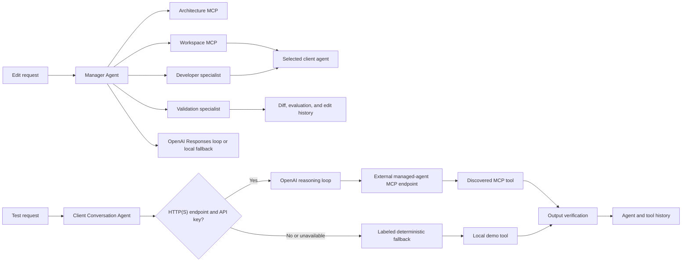

# Agentic AI Manager

Agentic AI Manager is a working hackathon MVP of a conversational development environment for enterprise agents. A user selects a client agent and tells the Manager Agent what outcome to change. The Manager chooses Architecture, Workspace, Developer, and Validation tools, inspects the client agent, prepares the edit, evaluates it, and either stages it for review or applies it automatically. A separate Test mode talks directly to the client agent and verifies its response.

The project is designed to make the complete loop visible in one demo—not just code generation, but the context gathering and operational guardrails that make generated tools credible.

## What works

- Live architecture index seeded with agents, tools, endpoints, and data sources
- Relevance-ranked discovery of reusable system components
- Optional OpenAI Responses API routing with a deterministic no-key fallback
- Safe, inspectable Python tool generation for order-status and inventory-risk workflows
- Static AST policy, dependency, JSON-schema, runtime, and output-contract validation
- Registration into a persistent JSON metadata store
- Continuous representative-input health probes
- Persistent, agent-scoped conversation history
- Conversational client-agent editing through the Manager Agent
- OpenAI Responses API tool-calling loop when `OPENAI_API_KEY` is configured
- Deterministic offline orchestration through the same specialist-tool sequence
- Per-client local workspace sectors with `agent.json`, `instructions.md`, and `tools.json`
- User-selectable Review and Auto write modes
- Focused or full agent-context import for each request
- Per-message tool traces and acceptance-criteria-based output verification
- Minimal MCP Streamable HTTP-style JSON-RPC gateways for the specialist services
- MCP capability discovery for every managed agent through `initialize`, `tools/list`, `prompts/list`, and `resources/list`
- Editable per-agent MCP endpoints with connection testing and discovered-tool inspection
- Live client-agent conversations that let OpenAI reason over discovered HTTP(S) MCP tools and execute them remotely
- Explicit `Live MCP`, `Fallback demo`, and `Local demo` receipts on every client-agent response
- An independent support-agent server under `external_agent/` for realistic cross-process MCP testing
- Read-only, workspace-scoped file discovery for Manager context with traversal and secret-file protections
- Standalone multi-page React/Vite control plane with dedicated Dashboard, Workspace, Managed agents, Activity, and System health routes
- Mock enterprise commerce endpoints so the demo runs completely locally

## Architecture



The React frontend and FastAPI backend are independent applications. Vite owns the UI development and production build; Uvicorn runs only the REST and MCP APIs. Every backend agent has its own module under `backend/app/agents`. REST and MCP transports are separate from the agents, so each agent can later move into an independent service without changing its domain logic.

## Quick start

```bash
python3 -m venv .venv
source .venv/bin/activate
pip install -e '.[dev]'
cd frontend && npm install
```

Start the complete application from one terminal:

```bash
make dev
```

This starts both services, prefixes their combined logs, and stops both with one Ctrl+C. It normally uses ports 5173 and 8000; if either is already occupied, the launcher automatically selects the next open port and prints the exact URLs. The dashboard is preloaded with the primary demo prompt and no API key is required.

The UI is divided into focused routes:

| Route | Purpose |
|---|---|
| `/` | See active work, agent status, attention items, and recent activity |
| `/workspace` | Edit an agent's configuration or switch to Test mode to query and verify it |
| `/agents` | Browse managed agents and enter their individual workspaces |
| `/agents/:agentId` | Review one agent's conversations, capabilities, and nested tool workspaces |
| `/history` | Return to agent conversations and capability runs |
| `/health` | Review continuous probes |

Each data-heavy route follows the same progressive-disclosure model: search
first, filter by the relevant dimensions, and open deeper evidence only when
needed. Raw workspace files are not a main product surface; they are used only
as scoped context evidence during Manager orchestration.

Workspace fills the complete browser viewport. The global sidebar retracts into
one floating menu control and opens as a translucent overlay, so it never takes
width away from the workspace. Agents are selected from one compact list rather
than a permanent row. Manager mode is dominated by conversation, with history
and client files on the left and live tool routing, changes, and validation on
the right. Test mode remains a separate direct conversation with the client
agent.

Navigation, filters, disclosures, cards, feedback, and routed workspaces use a
shared motion system with reduced-motion accessibility support. Typography uses
a softer rounded system stack, while monospaced type is reserved for tool names
and technical contracts.

`make dev` works from both the project root and the `frontend/` directory.

You can also invoke the launcher directly:

```bash
.venv/bin/python scripts/dev.py
```

The individual `make dev-backend` and `make dev-frontend` commands remain available when separate terminals are useful.

To enable model-backed routing, copy `.env.example` to `.env`, export the variables in your shell, and set `OPENAI_API_KEY`. If the provider is unavailable or returns an invalid response, the Manager records that fact and safely falls back to deterministic routing.

```bash
export OPENAI_API_KEY="your-key"
export OPENAI_MODEL="gpt-5-mini"
uvicorn backend.app.main:app --reload
```

For client-agent Test mode, an HTTP(S) `mcp_endpoint` plus
`OPENAI_API_KEY` activates the live reasoning path. The model sees the tools
advertised by that endpoint, chooses tool calls, and the Manager sends those
calls back to the external MCP server. Missing configuration or top-level live
failures use the existing deterministic behavior, but the response is marked
`Fallback demo` with the exact reason; it is never presented as a live result.

For separate hosting, set `VITE_API_BASE_URL` in the frontend and add the frontend origin to `AGENT_MANAGER_FRONTEND_ORIGINS` in the backend.

## Live external-agent verification

The repository includes a completely independent MCP server in
`external_agent/`. It imports nothing from `backend/`, listens on port `8100`,
and returns distinctive provenance fields that the local demo tools do not
contain.

1. In terminal one, export an OpenAI key before starting the main app:

   ```bash
   cd /path/to/AgentManager
   export OPENAI_API_KEY="your-key"
   export OPENAI_MODEL="gpt-5-mini"
   make dev
   ```

   Use the dashboard URL printed by the launcher. The frontend and main backend
   still share this one terminal.

2. In terminal two, start the independent agent:

   ```bash
   cd /path/to/AgentManager/external_agent
   ../.venv/bin/python app.py
   ```

   It should print `Uvicorn running on http://127.0.0.1:8100`.

3. In the UI, open **Managed agents**, select any agent, and stay on its
   **Overview** tab. Set **MCP endpoint** to:

   ```text
   http://127.0.0.1:8100/mcp
   ```

4. Click **Test & discover**. A successful result must show server
   `standalone-support-agent` and exactly these two tools:

   - `support.lookup_ticket`
   - `support.estimate_resolution`

5. Click **Edit in workspace**, switch from **Manager** to **Test client**, and
   start a new conversation with:

   ```text
   Look up support ticket TCK-9001 and include the live proof value.
   ```

6. Confirm all of the following on the response:

   - the green receipt says **Live MCP**, not **Fallback demo** or **Local demo**;
   - the provider is `openai:<configured-model>+mcp`;
   - the endpoint shown is `http://127.0.0.1:8100/mcp`;
   - **See evidence → Tool execution trace** contains
     `support.lookup_ticket`;
   - the tool output contains
     `"source": "standalone-external-agent"` and
     `"proof": "LIVE-MCP-TCK-9001"`;
   - the answer itself includes `LIVE-MCP-TCK-9001`.

   Those source and proof values only exist in the separate server's tool
   output, so together with the execution receipt they distinguish the live
   path from the built-in order, shipment, and inventory fixtures.

7. To verify that fallback cannot be hidden, stop the main app, unset
   `OPENAI_API_KEY`, restart it, and send another Test-client message to the
   same HTTP endpoint. The response must show the amber **Fallback demo**
   receipt, the sentence “The live agent was not used for this answer,” and
   the reason `OPENAI_API_KEY is not configured`.

Direct `curl` examples for `initialize`, `tools/list`, and `tools/call` are in
[`external_agent/README.md`](external_agent/README.md).

### Workspace file access

Browsers cannot silently access arbitrary local files. Instead, the backend exposes one explicit, read-only workspace boundary. It defaults to this repository and can be changed before startup:

```bash
export AGENT_MANAGER_WORKSPACE_ROOT="/absolute/path/to/a/codebase"
make dev
```

The file service blocks traversal outside that root and excludes `.git`, virtual environments, dependency/build directories, `.env` files, credentials, private keys, and unsupported binary formats. Production deployments should mount only repositories the Manager is authorized to inspect.

## Demo script

1. In Workspace, select the Logistics Agent and keep Manager mode active.
2. Choose **Review** permission mode and ask the Manager to make the agent verify delivery promises against carrier evidence.
3. Show the Architecture, Workspace, Developer, and Validation route in Live work.
4. Expand the proposed instructions diff and apply the reviewed change.
5. Switch to **Test client**, ask “Where is ORD-1042 and is it delayed?”, and inspect its grounded output.
6. Switch the Manager to **Auto** to demonstrate autonomous validated writes.
7. Return to the client agent or Activity page to review its conversation and tool history.

The alternate Inventory risk prompt demonstrates routing to a second constrained capability and supports the example SKU `SKU-BLU-07` as an out-of-stock result.

## API

| Method | Path | Purpose |
|---|---|---|
| `GET` | `/api/overview` | Architecture, counts, MCP services, and recent builds |
| `POST` | `/api/builds` | Run the full build pipeline |
| `GET` | `/api/builds` | Return the build audit trail |
| `GET` | `/api/health` | Probe endpoints and registered tools |
| `GET` | `/api/managed-agents` | Return managed agents and discovered MCP capabilities |
| `POST` | `/api/managed-agents/discover` | Refresh all managed-agent MCP capabilities |
| `POST` | `/api/managed-agents/{agent_id}/discover` | Test and refresh one managed agent's MCP endpoint |
| `PATCH` | `/api/managed-agents/{agent_id}` | Persist the editable agent configuration |
| `GET` | `/api/manager/conversations` | Return Manager work history for a selected client agent |
| `POST` | `/api/manager/message` | Run the Manager tool-selection and edit loop |
| `POST` | `/api/manager/conversations/{conversation_id}/apply` | Apply reviewed staged changes |
| `GET` | `/api/conversations` | Return all conversations or filter them by agent |
| `GET` | `/api/conversations/{conversation_id}` | Return one complete conversation |
| `POST` | `/api/conversations/message` | Run an agent turn, its tool, and output verification |
| `GET` | `/api/workspace/files` | List a safe directory inside the configured workspace |
| `GET` | `/api/workspace/file` | Preview an allowed text/source file |
| `POST` | `/api/tools/{tool_id}/execute` | Execute a registered tool |
| `POST` | `/api/reset` | Restore the clean demo state |
| `POST` | `/mcp/{server}` | JSON-RPC MCP gateway |
| `GET` | `/docs` | Interactive OpenAPI documentation |

Example build:

```bash
curl -s http://localhost:8000/api/builds \
  -H 'Content-Type: application/json' \
  -d '{"prompt":"Build a tool that checks an order shipment status and summarizes delays","deploy":true}'
```

Example MCP tool discovery:

```bash
curl -s http://localhost:8000/mcp/architecture \
  -H 'Content-Type: application/json' \
  -d '{"jsonrpc":"2.0","id":1,"method":"tools/list","params":{}}'
```

## Verification

```bash
pytest
python3 -m compileall -q backend
cd frontend && npm run check
cd frontend && npm run build
```

The tests cover agent conversations, context import, tool traces, output verification, the complete order and inventory pipelines, live execution, continuous monitoring, request validation, and MCP discovery/calling.

## Security posture and MVP boundaries

Generated source is never taken directly from model output. The Developer service selects a constrained implementation template, and Validation rejects imports, dangerous built-ins, unexpected entry points, unresolved endpoints, invalid schemas, failed representative executions, and incomplete outputs. Execution receives only a small built-in allowlist and a controlled HTTP resolver.

For a production version, run generated code in an isolated worker/container, replace the JSON file with a transactional registry, use signed deployment artifacts, add authentication and role-based approval, scan real repositories, connect production observability, and use the official MCP SDK for full session/transport compliance. The current JSON-RPC gateway intentionally implements only the `initialize`, `tools/list`, and `tools/call` subset needed for the demo.

## Project layout

```text
frontend/
  src/
    App.jsx                   Routed React application state
    pages/                    Agent workspace and operational pages
    layout/                   Shared navigation shell
    api.js                    Configurable backend API client
    main.jsx                  React application entrypoint
    styles.css                Responsive soft-contrast design system
  public/
    favicon.svg               Application icon
  index.html                  Vite document shell
  vite.config.js              React build and local API proxy
  package.json                Frontend dependencies and scripts

backend/
  app/
    main.py                   Minimal FastAPI composition entrypoint
    dependencies.py           Dependency and agent composition root
    config.py                 Environment and directory configuration
    agents/
      manager_agent.py        Full multi-stage orchestration pipeline
      agentic_manager.py      Conversational client-agent editing loop
      conversation_agent.py   Agent chat, tool use, and output verification
      architecture_agent.py   Architecture search and reuse discovery
      developer_agent.py      Constrained tool synthesis
      validation_agent.py     Static and runtime guardrails
      monitoring_agent.py     Continuous health probes
    api/
      routes.py               Workspace REST API
    mcp/
      gateway.py              MCP JSON-RPC transport
    core/
      models.py               Shared domain and API contracts
      seed.py                 Demo enterprise architecture
      storage.py              Architecture, conversation, and build registry
    infrastructure/
      llm_router.py           Optional OpenAI routing adapter
      live_conversation.py    OpenAI reasoning loop over live remote MCP tools
      mcp_client.py           Managed-agent MCP discovery and tool-call client
      managed_workspace.py    Per-client editable local file sectors
      openai_manager.py       OpenAI Responses API function-calling loop
      mock_system.py          Local enterprise API stand-ins
      tool_runtime.py         Generated-tool execution runtime
      workspace_access.py     Scoped, read-only file inspection
  data/                       Runtime state, ignored by Git
  generated_tools/            Validated generated modules

external_agent/
  app.py                      Independent MCP server and real support tools
  pyproject.toml              Standalone Python package and dependencies
  Makefile                    Independent install and run commands
  README.md                   Server setup and direct protocol checks

tests/
  backend/                    End-to-end API, live MCP, and fallback tests
```

### Agent ownership

| Agent | File | Responsibility |
|---|---|---|
| Manager | `backend/app/agents/manager_agent.py` | Coordinates the complete build lifecycle |
| Agentic Manager | `backend/app/agents/agentic_manager.py` | Selects specialists and edits a client agent conversationally |
| Conversation | `backend/app/agents/conversation_agent.py` | Runs scoped agent turns and verifies grounded outputs |
| Architecture | `backend/app/agents/architecture_agent.py` | Finds existing agents, tools, APIs, and reusable components |
| Developer | `backend/app/agents/developer_agent.py` | Produces constrained tool implementations and plans |
| Validation | `backend/app/agents/validation_agent.py` | Enforces safety, contracts, dependencies, and behavior |
| Monitoring | `backend/app/agents/monitoring_agent.py` | Continuously probes registered tools and endpoints |
